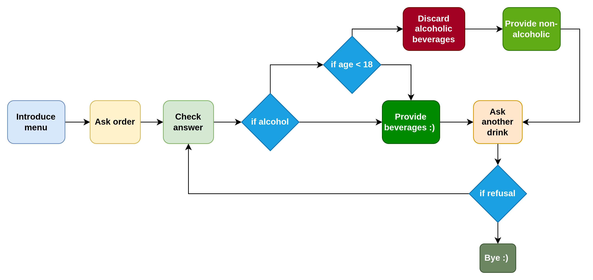

# Speech-Recognition-Bar-Scenario

## Introduction
Project was built to realize bar tender and customer conversation scenario in any bar. There are some default data that is needed to be modified through the source code such as refusal messages and menu.

## Working principle
Before diving into details, I would like to explain source files in general. You can find configuration of the microphone, text to speech and speech to text modules in [src/get_message.py](src/get_message.py). While [src/nlp.py](src/nlp.py) is utilized to configure nlp related tasks, [src/process_scenarios.py](src/process_scenarios.py) is used for realizing the sequence of actions.

Following figure represents the working principle of the project.
<p align="center">
 
 </p>

Figure depicts that the initial action is introduction of the menu by the bot to the user. Then microphone is calibrated (is not depicted in the figure) and order is asked from the user. At the following step, user's order is checked. If it contains alcoholic beverages they will be kept (if user is 18 years old or older than that) or discarded (otherwise) from the order according the user's age. According to the rest of the order, beverages (if any left) will be provided to the user (ofc virtually :)). At the end, user will be asked whether he/she wants something else. In case the answer include refusal element (no, no thanks or thanks) bot will terminate the conversation. 
Note: Do not try to check the bugs (e.g., No, I want orange juice), since project is not robust towards such bugs :D 

## Setup
Notice that project was developed on Linux operating system, so that it may be incompatible with windows. On ubuntu you might need to have further procedures done. Such as:
  ```python
  sudo apt install portaudio19-dev
  ```
 ```python
  sudo apt-get install mpg321
  ```


_**Best Regards**_

_**Mahammad Namazov**_

24.02.2020
